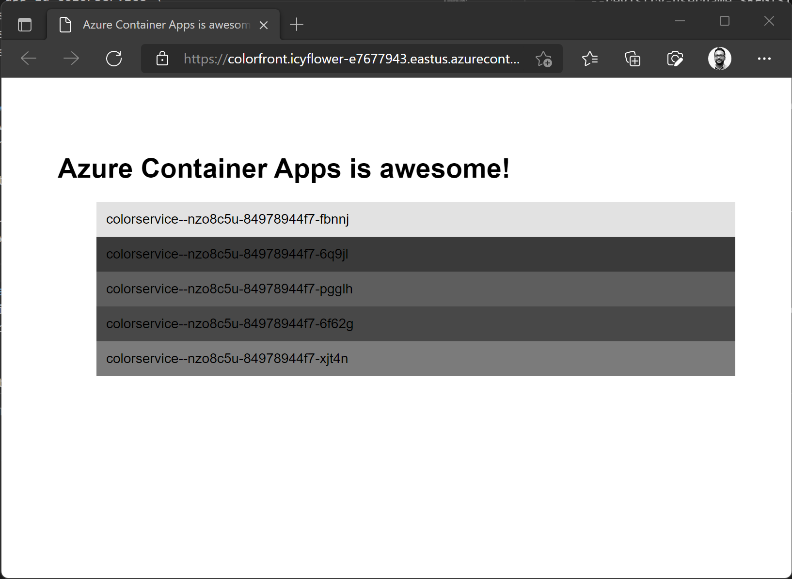
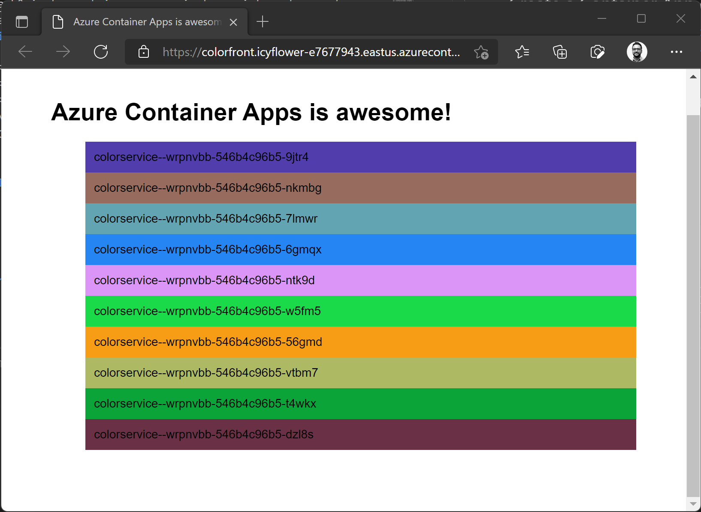

# Color App sample using Dapr on Azure Container Apps
The application consists of two components:
- `colorservice` is an ASP.net Core 6.0 microservice that generates hexadecimal color codes.
- `colorfront` is a Node.JS app that calls the `colorservice` via [Dapr service invocation](https://github.com/sabbour/containerapps-colors/blob/main/colorfront/routes/colors.js) to render the colors in the browser. Each color block corresponds to the hostname of the pod responding to the request.

## Create a Container App environment
Follow the instructions here <https://docs.microsoft.com/en-us/azure/container-apps/get-started-existing-container-image?tabs=bash&pivots=container-apps-private-registry> to create a Log Analytics workspace and create the environment.
## Define deployment variables
```
REGISTRY_LOGIN_SERVER=<your container registry>
REGISTRY_USERNAME=<your container registry username>
REGISTRY_PASSWORD=<your container registry password>
ENVIRONMENT_NAME=<your Container Apps environment name>
RESOURCE_GROUP=<your resource group name>
```

## Build the containers
```
docker build . -t $REGISTRY_LOGIN_SERVER/colorfront:v1
docker build . -t $REGISTRY_LOGIN_SERVER/colorservice:v1
```

## Push the containers
```
docker push $REGISTRY_LOGIN_SERVER/colorfront:v1     
docker push $REGISTRY_LOGIN_SERVER/colorservice:v1    
```

## Deploy the frontend app (Node.js, Express)
Deploy the frontend, and enable Dapr.
```
az containerapp create \
--name colorfront \
--resource-group $RESOURCE_GROUP \
--environment $ENVIRONMENT_NAME \
--image $REGISTRY_LOGIN_SERVER/colorfront:v1 \
--target-port 3000 \
--ingress 'external' \
--enable-dapr \
--dapr-app-port 3000 \
--dapr-app-id colorfront \
--registry-login-server $REGISTRY_LOGIN_SERVER \
--registry-username $REGISTRY_USERNAME \
--registry-password $REGISTRY_PASSWORD
```

## Deploy the backend service (ASP.NET Core 6.0)
Deploy the backend, and enable Dapr.

```
az containerapp create \
--name colorservice \
--resource-group $RESOURCE_GROUP \
--environment $ENVIRONMENT_NAME \
--image $REGISTRY_LOGIN_SERVER/colorservice:v1 \
--target-port 5000 \
--ingress 'internal' \
--min-replicas 1 \
--max-replicas 10 \
--dapr-app-port 5000 \
--enable-dapr \
--dapr-app-id colorservice \
--registry-login-server $REGISTRY_LOGIN_SERVER \
--registry-username $REGISTRY_USERNAME \
--registry-password $REGISTRY_PASSWORD
```

## View the application
Retrieve the fully-qualified domain name for the frontend and open that in your browser.
```
az containerapp show \
--name colorfront \
--resource-group $RESOURCE_GROUP \
--query latestRevisionFqdn -o tsv
```



## Update an environment variable 
This will trigger a new revision deployment any you should see the application responding in new colors.

```
az containerapp update  \
--name colorservice \
--resource-group $RESOURCE_GROUP \
--environment-variables MODE=color
```

