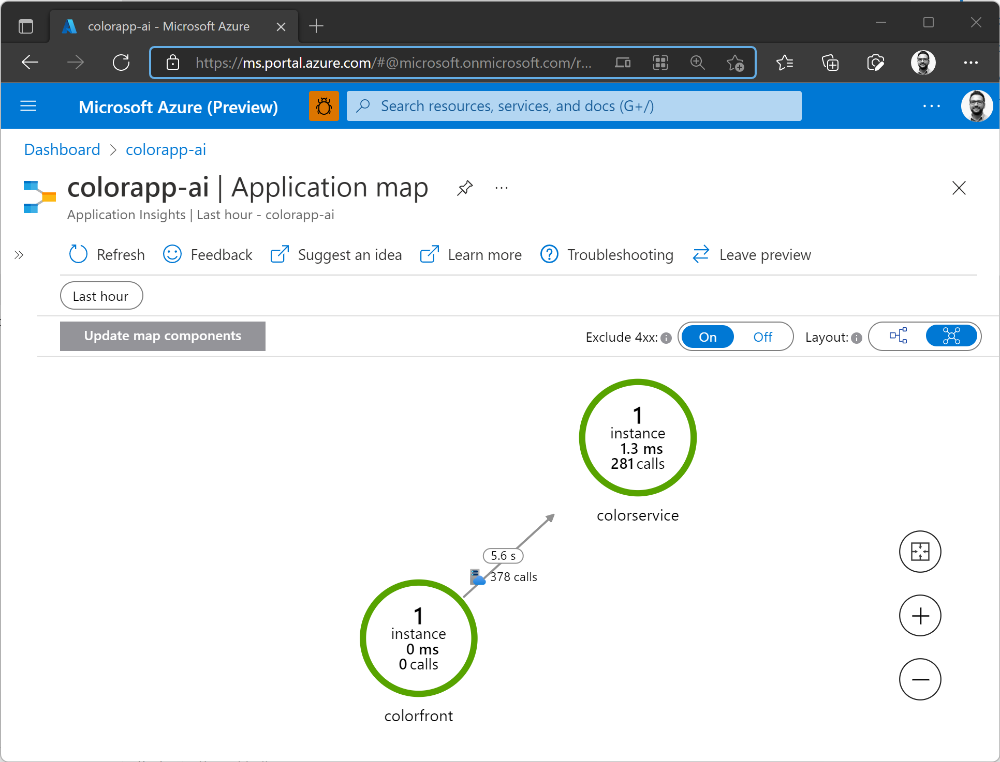

# Color App sample using Dapr on Azure Container Apps
The application consists of two components:
- `colorservice` is an ASP.net Core 6.0 microservice that generates hexadecimal color codes.
- `colorfront` is a Node.JS app that calls the `colorservice` via [Dapr service invocation](https://github.com/sabbour/containerapps-colors/blob/main/colorfront/routes/colors.js) to render the colors in the browser. Each color block corresponds to the hostname of the pod responding to the request.

Follow the instructions to [create a Log Analytics workspace](https://docs.microsoft.com/en-us/azure/container-apps/get-started-existing-container-image?tabs=bash&pivots=container-apps-private-registry) and retrieve its client ID and secret. You'll also need to [create an Application Insights resource](https://docs.microsoft.com/en-us/azure/azure-monitor/app/create-new-resource) and retrieve its instrumentation key.

## Define deployment variables
```
REGISTRY_LOGIN_SERVER=<Container registry hostname>
REGISTRY_USERNAME=<Container registry username>
REGISTRY_PASSWORD=<Container registry password>
ENVIRONMENT_NAME=<Container Apps environment name>
RESOURCE_GROUP=<Resource group name>
LOG_ANALYTICS_WORKSPACE_CLIENT_ID=<Log Analytics workspace client ID>
LOG_ANALYTICS_WORKSPACE_CLIENT_SECRET<Log Analytics workspace client secret>
APPINSIGHTS_KEY=<Azure Application Insights instrumentation key>
```

## Build the containers
Build the containers using Docker (or Azure Container Registry build).
```
docker build . -t $REGISTRY_LOGIN_SERVER/colorfront:v1
docker build . -t $REGISTRY_LOGIN_SERVER/colorservice:v1
```

## Push the containers
Push the container images to the container registry.
```
docker push $REGISTRY_LOGIN_SERVER/colorfront:v1     
docker push $REGISTRY_LOGIN_SERVER/colorservice:v1    
```

## Create a Container App environment
Create the environment, passing in the Log Analytics and Azure Application Insights information.
```
az containerapp env create \
--name $ENVIRONMENT_NAME \
--resource-group $RESOURCE_GROUP \
--location $LOCATION \
--logs-workspace-id $LOG_ANALYTICS_WORKSPACE_CLIENT_ID \
--logs-workspace-key $LOG_ANALYTICS_WORKSPACE_CLIENT_SECRET \
--instrumentation-key $APPINSIGHTS_KEY
```

## Deploy the backend service (ASP.NET Core 6.0)
Deploy the backend, and enable Dapr.

```
az containerapp create \
--name colorservice \
--resource-group $RESOURCE_GROUP \
--environment $ENVIRONMENT_NAME \
--image $REGISTRY_LOGIN_SERVER/colorservice:v1 \
--target-port 5000 \
--ingress 'internal' \
--min-replicas 0 \
--max-replicas 10 \
--dapr-app-port 5000 \
--enable-dapr \
--dapr-app-id colorservice \
--registry-login-server $REGISTRY_LOGIN_SERVER \
--registry-username $REGISTRY_USERNAME \
--registry-password $REGISTRY_PASSWORD
```

## Deploy the frontend app (Node.js, Express)
Deploy the frontend, and enable Dapr.
```
az containerapp create \
--name colorfront \
--resource-group $RESOURCE_GROUP \
--environment $ENVIRONMENT_NAME \
--image $REGISTRY_LOGIN_SERVER/colorfront:v1 \
--target-port 3000 \
--ingress 'external' \
--enable-dapr \
--dapr-app-port 3000 \
--dapr-app-id colorfront \
--registry-login-server $REGISTRY_LOGIN_SERVER \
--registry-username $REGISTRY_USERNAME \
--registry-password $REGISTRY_PASSWORD
```

## View the application
Retrieve the fully-qualified domain name for the frontend and open that in your browser.
```
az containerapp show \
--name colorfront \
--resource-group $RESOURCE_GROUP \
--query latestRevisionFqdn -o tsv
```


## Update an environment variable 
This will trigger a new revision deployment any you should see the application responding in new colors.
```
az containerapp update  \
--name colorservice \
--resource-group $RESOURCE_GROUP \
--environment-variables MODE=color
```


## Application map on Azure Application Insights
Because you configured the Azure Container App environment with the instrumentation key for Azure Application Insights and enabled Dapr, tracing will be automatically wired and you should be able to see calls between the `colorfront` and `colorservice`.

